# Fisicoquímica de sistemas moleculares organizados 

## Clase # 1 Problemas con zoom 22/09/20

*No hubo clase debido a problemas técnicos*

## Clase #2 Presentación e introducción 24/09/20

### Evaluación 

- Exámenes (3 parciales) **60%**
- Lecturas de artículos y ensayos (1-2 semanales) **20%**
- Tareas **20%**

### Niveles de organización 

**Química supramolecular** : Rama que se encarga del estudio de sistemas químicos compuestos por un número discreto de moléculas.

**Autoensamblaje molecular**: Es la construcción de sistemas moleculares sin guía externa, como consecuencia de interacciones no covalentes(por interacciones débiles) entre las moléculas que la forman y el medio en la que esta inmerso, para dar lugar a una estructura mas compleja.

**Tipos de autoensamblaje**: 

- *Autoensamblaje intermolecular*: Es la construcción de sistemas supramoleculares, Ej. unión de dos o ma s proteínas, moléculas,.

- *Autoensamblaje intramolecular*: Plegamiento de las moléculas por medio de las interacciones intra moleculares (plegamiento de las proteínas).

Especies que son formadas por el autoensamblaje molecular: micelas, vesículas, dobles capas lipídicas(membranas celulares) y plegamiento de proteínas, son las más características.

## Clase #3 niveles de organización, distribuciones espaciales e isomerías de las moléculas 29/09/20 

**Molécula**: Especie química formada por dos o más átomos unidos mediante enlaces covalentes, que presenta estequiometría(fórmula química), peso(isótopos) y geometría única (configuración).

> Para poder definir a una molécula se debe conocer su estequiometria (Ej C2H2C2) y su estructura química (su geometría en el espacio Ej cis-trans)

**Macromoléculas**: moléculas muy grande (numero de monómeros que la conforman) 

**Macromoléculas biológica o biopolímero**: molécula grande y compleja(presentan un *niveles de organización* de estructura terciaria) con actividad biológica. 

Profe:

*Criterio por número de monómeros*: 25 o más unidades monoméricas se denomina como proteína y abajo son oligómeros.

yop:
 
 **Clasificación** 
- 10 > oligopéptido >= 2
- 50 > péptido >= 10
- 100 > polipéptido >=50
- Proteína >= 100

Los *polímeros* son macromoléculas, algunos tipos de polímeros son los polisacáridos (polímeros de azucares) o proteínas (polímeros de aminoácidos)

### **Niveles de organización**
- Monómeros (1er nivel)
- Estructura primaria (2er nivel)
- Estructura secundaria (helicoidal) (3er nivel)
- Estructura terciaria (estructura nativa) (4er nivel)
- Estructura cuaternaria (5er nivel)

**Monómero**: unidad básica que conforma a una  macromolécula; se denominan de distintas formas dependiendo del tipo de macromolécula formada, en una *proteína* son denominados aminoácidos,en un *polisacárido* son azucares y en *acido nucleicos* son nucleótidos.

**Estructura primaria**: macromolécula formada por a polimerización de los monómeros; creando un arreglo lineal o secuencia de residuos de monómeros unidos mediante enlaces covalentes.

*Residuo de monómero*: monómero incompleto debido a la formación del enlace covalente que une a una o dos unidades monoméricas (Ej. unión de dos aminoácidos por medio de la formación del enlace peptídico, en la cual se pierden átomos para su formación por lo que ya no es la unidad monomérica inicial).

**Estructura secundaria**: Estructura regular que se encuentra de local (formada dentro de la macromolécula) puede estar en solo una zona o en todo la macromolécula o en regiones, la particularidad de este nivel es que estas estructuras(geometría) son tipo helicoidal.

**Estructura terciaria**: Arreglo tridimensional de los átomos(o los residuos monoméricos) que constituyen a la macromolécula, esta es la estructura que presenta una actividad biológica (se le denomina com estructura nativa).

**Estructura cuaternaria**: Estructura donde se unen por dos o mas subunidades(estructuras terciarias) por medio de interacciones débiles, lo cual forma estructuras más complejas con actividad biológica(Ej. Hemoglobina).

**Biofisicoquímica**: Rama que se encarga de entender las reglas que establecen los distintos niveles de complejidad estructural(niveles de organización), tiene como objetivo el predecir la estructura tridimensional(4to nivel de organización), a partir de la secuencia de residuos monoméricos, un ejemplo de lo que estudia es el problema de plegamiento.

*Problema de plegamiento*: El conocer la secuencia de residuos monoméricos de una macromolécula no es suficiente para conocer(predecir) la estructura terciaria que tendrán.

### **Configuración y conformación**

**Configuración**: Se refiere al [arreglo/distribución/disposición] de átomos con respecto a un enlace pi(doble o triple enlace) de un *átomo quiral* el cual no presenta rotación libre.

Lo anterior nos dice que para obtener una configuración distinta necesario romper un enlace enlace pi para obtener un enlace sigma(de un intermediario de la molécula), rotarlo y formar nuevamente el enlace pi, para cambiar la configuración de una molécula. 

*Ej. pasar de una conformación cis a una de tipo trans (implica la ruptura de un enlace, la rotación y formación del mismo enlace).*

**Conformación**: Se refiere al [arreglo/distribución/disposición] de átomos con respecto a un enlace sigma(enlace sencillo) de un *átomo quiral* el cual tiene rotación libre.

Lo anterior nos dice que para obtener una conformación distinta solo se debe de rotar un enlace enlace sigma en la molécula. 

*Ej. pasar de una conformación eclipsada a una alternada (implica la rotación de un enlace).*

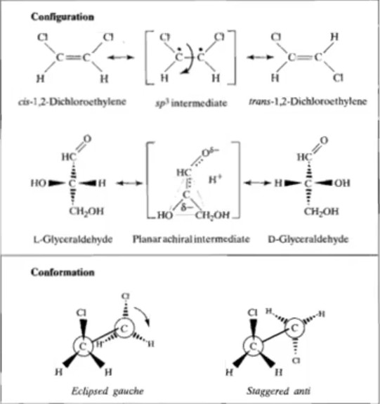

### *Tipos de isomería* 

**Notaciones relativas (L y D)**

*El 99% de las proteínas que existen en la naturaleza son isómeros L, mientras que los azúcares y ácidos nucleicos son D*

En el caso de las proteínas debido a que presentan un gran número de enlaces sigma con centros quirales existen miles-millones de conformaciones posibles, sin embargo hay pocas conformaciones que llevan a la formación de las estructuras terciarias de las proteínas la cual es la que posee actividad biológica. 

**Notaciones de conformaciones Fisher**

hay tres tipos: *eclipsada, alternada anti y gauche,* dentro de esta notación existen dos términos que ayudan a identificar la conformación de una macromolécula.

**Angulo de torsion**: Es el ángulo que se forma sobre un plano donde se representa los átomos unidos al átomo quiral (plano de la proyección de Fisher)

**Angulo diedro**: Es el ángulo que se forma entre dos planos perpendiculares(planos en forma de bisagra) donde se representan los átomos unidos al átomo quiral.

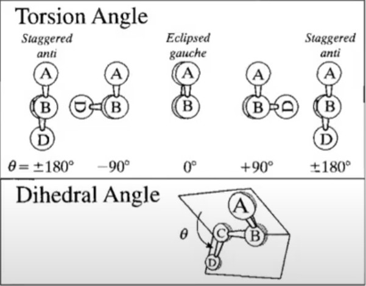

**Gráficos de Ramachandran**: gráficos que permite determinar que conformaciones no son posibles debido al impedimento estérico, el cual se basa conforme a los ángulos diedros y los de torsión.

## Clase #4 01/10/20 

### Tipos de interacciones

Las **interacciones fuertes**(enlaces covalentes) se denominan así ya que energéticamente hablando se requiere de una energía alta(entre 200-800kJ/mol) para romper y formar dichas interacciones(enlace).

>*Los enlaces covalentes determinan la **configuración** que tendrá la macromolécula.*

Las *interacciones débiles* son aquellas energéticamente requieren menor energía (0-60kJ/mol) para romper y formarse dichas interacciones.

>*Los interacciones débiles determinan la **conformación** que tendrá la macromolécula.*

**Interacciones Débiles**

- carga-carga (electrostática)(1/r)
- carga-dipolo (1/r^2)
- dipolo-dipolo (1/r^3)
- carga-dipolo inducido (1/r^4)
- dispersión (1/r^6)
- repulsion (1/r^12)

Las interacciones débiles tienen una dependencia distancia (r) la cual es inversamente proporcional(distancia entre los átomos o grupos funcionales que presentan dicha interacción)

Por ejemplo las interacciones electroestáticas son fuerzas que interactúan a largas distancias mientras que las de repulsion solo a distancias muy cortas.

*Demostración*

distancia de 1A
carga-carga 1/10=0.1
dispersion 1/10^12=1x10^-12

De lo anterior vemos que la fuerzas tienen una mayor fuerza que las de dispersión a la misma distancia, por lo que se denominan fuerzas de largo alcance y las otras de corto alcance.

> La polarizabilidad(constante dieléctrica) del medio influye en la intensidad(magnitud de las interacciones), conforme aumenta la polarizabilidad del medio la intensidad de la energía potencia de las interacciones disminuirá.

En los organismos vivos la composición de las células es 70% agua y 30% lo demás.

### **Estructura del agua**

Presentan 3 momentos dipolares():
- Si es gas su momento dipolar =1.855 debye
- si es líquido su momento dipolar =2.6 debye
- si es un sólido su momento dipolar =3 debye

Su momento dipolar 78.5D0 (donde D0 es el momento dipolar del vacío).

Las interacciones que presenta el agua son de tipo dipolo-dipolo, las cuales son denominas puentes de hidrógeno, las cuales se forman debido a que la densidad electrónica negativa de la molécula se encuentra en el átomo de oxígeno debido a que a los dos pares de electrones que tiene y los hidrógenos por el contrario presentan una densidad de carga positiva, y cuando otra molécula de agua se acerca se generan las interacciones electrostáticas dipolo-dipolo donde el donador de densidad de carga es el oxígeno y el hidrógeno como aceptor.

> Se pueden hacer hasta 4 puentes de hidrogeno dos de ellos actúan como aceptores de carga y dos como donadores por los pares de electrones.

**Tiempo de vida**

Las interacciones de puentes de hidrógeno tienen una duración de 10^-12s, sin embargo por el número de moléculas esto es una cantidad enorme de puentes de hidrógeno.

**Genera estructuras organizadas**, la organización de las moléculas del agua son más organizadas en su estado sólido, y en el estado líquido es menor con respecto al sólido, pero tiene aun así demuestra un grado de organización.

Un ejemplo de esto es la *tensión superficial* ya que las interacciones en la superficie son más fuertes con respecto a otros líquidos, y el agua presenta la tensión superficial de los líquidos(sin contar al mercurio) lo cual se debe a estas interacciones.

Los solutos que son solvatados por el agua son conocidos como *clatratos*.

Otra propiedad que caracteriza al agua es su capacidad de auto disociación, lo cual permite plantear su constate de equilibrio (Kw)

Los puentes de hidrógeno esta presente en otras moléculas, sin embargo solo el agua puede formar 4.

Como punto a destacar en los puentes de hidrógeno se ha visto que la distancia entre los tres átomos que conforman un puente de hidrógeno es menor a la que debería ser teóricamente, lo cual nos dice que en esta interacción existe una penetración entre las densidades electrónicas lo cual da como resultado que sean de las interacciones débiles con una mayor energía.

Las moléculas de agua rodean a un soluto, lo cual da como resultado una pérdida de la entropía (dicha perdida ocurre sin distinción si es un soluto hidrofóbico o hidrofílico).

Por lo anterior lo que hace que un soluto sea soluble en agua son las interacciones de tipo polar, dipolo-dipolo o electroestático que se puede dar entre el soluto y las moléculas del agua(las cuales son muy polarizables, por lo que interacciones electrostática o dipolo-dipolo son energéticamente favorecidas), esto en el caso de un soluto de carácter hidrofílico, en esta se forman clatratos de un tipo en especial.

En el caso de un soluto hidrofóbico, como las interacciones electroestáticas y dipolo-dipolo no son favorecidas se forman clatratos que aíslan pequeñas cantidades del soluto formando microgotas en pequeñas cantidades y cuando es mas soluto se forman fases.

Finalmente podemos concluir que el proceso de solubilización de un soluto en un disolvente esta dada por la contribución entálpica.

## Clase #5 Teoría 06/10/20

### Clatratos de agua

Cuando un soluto se encuentra en solución esta es envuelta por moléculas de agua para la formación de estructuras llamadas clatrato.

### Equilibrio del agua  

Esta permite que haya una autodisociación del agua.

### Puentes de hidrógeno

Estas pueden darse en más especies además del agua en la cual hay un donador de densidad electrónica (par de electrones libres) y un aceptor de la densidad (normalmente un protón)

Al analizar las distancia de que se esperarían por los radios de van der wals se sabe que existe un translape de la densidad electrónica ya que la distancia del puente de hidrógeno es menor(aprox 20-30%) lo cual es lo que explica el por que a pesar de ser un dipolo-dipolo que es una interacción ser débil es de las más fuertes.

En el caso de las proteínas hay una competencia por los puentes de hidrógeno las cuales predominan en la superficie con los grupos funcionales de los aminoácidos ya que hay tantas moléculas que su concentración es de 55 molar.

También es posible encontrar moléculas de agua en el interior pero poco probable.

### termodinámica de los clatratos

Cuando un soluto polar o no polar es agregado en una solución acuosa las moléculas de agua tienen que organizarse de una forma más eficiente para engaular a los soluto, formando estructuras tipo clatrato, lo que se traduce en una pérdida de entropía del medio, por lo que nos dice que la solubilidad está en función de las interacciones energéticamente favorables entre el agua(disolvente) y solutos (sean polares o que posean cargas definidas(iones)), mientras que los solutos no polares como las interacciones son poco favorables; en el caso de solutos polares esto es lo que hace que el cambio en la energía libre de gibbs del sistema sea menor o disminuya por lo que el proceso sea energéticamente favorecido en el caso contrario vemos que es la pérdida de entropía lo que hace que el cambio en la energía libre de gibbs no disminuya y por lo tanto hacen que el agua segregué a los solutos hasta el punto de aislarlo dando como resultado a nivel macroscópico una separación de fases.

### Propiedades macroscópiacas del agua

- *Capacidad calorífica*, el agua presenta un valor elevado de cp, lo cual tiene como consecuencia en el ámbito biológico el que las estructuras biológicas puedan mantener su estructura frente a cambios abruptos de temperatura.

### Moléculas anfifílicas 

Moléculas que tienen una región hidrofóbica e hidrofílica, cuando están en contacto con el agua buscan el estado de menor energía.

Por lo que se forman estructuras de varios tipos

-monocapa en la interfaz líquido-vapor
-micela
-vesícula (bicapa)

### Las proteínas y ácidos nucleicos son anfifílos 

Los aminoácidos pueden tener carácter anfifílo dependiendo de la cadena lateral que posean.

En el caso de los ácidos nucleicos sus bases nitrogenadas tiene como grupos hidrofílicos grupos polares en los azúcares y los grupos fosfatos que son afines al agua. 

De forma análoga a los anfifílos estas al estar expuestas al agua tiene una distribución en la cual mayoritariamente están expuestas al disolvente los grupos polares y dentro de las estructuras los componentes hidrofóbicos.

### Ambientes no polares

En las membranas celulares hay ambientes no polares las conformaciones son inversas a las que están en medio acuoso.

En estas los residuos que están expuestas al medio son los hidrofóbicos y las regiones hidrofílicas están en la parte interna.

Por ejemplos los canales iónicos tiene sus regiones hidrofílicas cargadas en el interior de su estructura lo cual les confiere la capacidad de ser canales iónicos.

### Canales iónicos

Hay dos características a tomar en cuenta

1) Las membranas celulares sirven como fronteras o contenedores de algo, esto tiene como consecuencia que para que algo entre y atraviese a la membrana requiera una cantidad muy grande de energía para mover las moléculas de las membranas para poder atraversarla, es decir que la membrana es una barrera física que hay que romper para poder pasar.

2) El que el interior de las membranas celulares sean no polares implica que la constante dieliéctrica o permitividad eléctrica sea muy diferente que en los ambientes polares, en este caso la constante dieléctrica es 40 la constante dieléctrica del vacío es decir que es 40 veces más pequeña que la constante dieléctrica del agua que es 80 veces la constante dieléctrica, esto quiere decir que si tengo un valor de muy grande constante dielectríca muy alto la energía potencial disminuye mucho, pero si es muy pequeño la energía de la interacción crece muchisimo.

### Autoenergía o energía de Born

Es la energía cuando tenemos una carga no acoplada(que no está interaccionado con otra carga) a otra carga, 

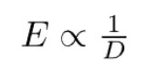

La energía es inversamente proporcional a la constante dieléctrica.

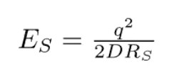

Se observa que es un cuadrado no pueden tener valores negativos de energía 

D constante dielectrica 
Rs radio efectivo o radio de stokes (tamaño de la especie química que se estudia )

La dependencia de la energía es inversamente proporcional al radio de stokes, por lo que para especies muy grande la energía será menor y si es pequeña será grande el valor de la energía.

Esto quiere decir que si calculamos la energía de ese ion en agua y la comparo con la energía del mismo ion en la membrana será 40 veces mayor que la autoenergía en la membrana que en el medio acuoso.

Resulta que la zona no polar de la membrana se convierte en una barrera energética ya que le costaría al sistema mucha energía el mantener ese ion en la región no polar.

Otra forma de transportar iones entre las membranas es por medio de moléculas conocidas como ionóferos el cual quela iones y se transporta por la parte no polar hasta el otro extremo y se da un proceso ce liberación.

### Membranas 

Espacios bidimencionales, regiones planas debido a su bajo grosor,y en su interior poseen regiones no polares en su interior  

### Proteínas

Su interior es una región no polar, este hecho provoca que en el interior de la proteína, tiene consecuencias en la reactividad, un ejemplo de esto es que los valores de Pka cambia en este ambiente, de los grupos ácidos su pka aumenta, en lo grupos básicos disminuyen en su valor de pka.

## Clase #6 Clase de problemas 8/10/20

### Cálculos de la autoeergía

Se resolvieron dos problemas 

Las unidades de la autoenergía es en Joules J

q = Es la carga de un electrón 1.6022x10^-19C

D0 = Es el calor de la permitidad del vacio 4pi8.885x10^-12CJ^-1m-1

Los radios de stokes deben ser usarse en unidades de metros.

El valor obtenido de la autoenergía se refiere a la energía que se necesita para que un ion estén en un medio polar (interior de una proteína o membrana), dicho valor en unidades de energía es muy pequeño por lo que se multiplica por el número de Avogadro para conocer la energía por mol.

Al comparar los valores de energía de un ion en agua en contraste de un medio no polar podemos ver que es mucho mayor el coste energético el tener a un ión en dicho ambiente, razón por la cual no se han encontrado iones solos (sin contra ion) dentro de las estructuras de proteínas.

El valor de la autoenergía es alto para iones positivos como negativos.

### Efecto de los ambientes no polares en la desionizción o desprotonación

Los valores de pka de los grupos ácidos incrementan su valor de pka y en los básicos su valor de pka disminuye, por lo que la desprotonación se dará en valor de ph mayor a la que se daría en medio acuoso, por lo anterior se encontrarán residuos con carga neutra o ser cancelada con otra carga en el interior de la proteína

### Ejercicio dos Aminoacido en medio polar y no polar 

Valor de pka de la cadena lateral de la lisina en medio acuoso es 10.3

Se calculó el valor de la autoenergía en medio acuoso y medio no polar 

Se hace una aproximación con la ecuación de Gibbs para la obtención del pka a partir de la energía libre en la cual hacemos aproximación de que la autoenergía como la energía libre.

La autoenergía esta en KJ/mol

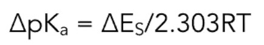

Después de obtener la autonergía s obtiene que disminuye el valor de pka a 4.8, en el caso de ph fisiológico de 7.4 dicha especie no esta protonoda por lo que se evita la situación de que este cargada el residuo de aminoácidos en el interior de la proteína, ya que si lo estuviera requeriría de mucha energía para tenerla dentro.

### Simetría

Las relaciones de simetría, los monómeros no tienen simetría, pero cuando se combinan y dan lugar a las macromoléculas biológicas y poseen simetría.

Simetría: Correspondencia en composición, forma y posición relativa partes que se encuentran en lados opuestos de un plano o que están distribuidos a lo largo de un centro o eje.

### Operadores de simetría 

Herramienta matemática que se aplica sobre un objeto en el cual se obtiene como resultado la proyección, nos permiten elucidar más fácil la estructura de una macromolécula biológica.

Objeto de estudio se conoce como motivo 

### Tipos de simetría 

Simetría puntual, distribución de los motivos o los objetos alrededor de un punto o un eje. 

- Especular
- Rotacional 
    - Radial
    - Helicoidal

### Sistema de referencia 

Se usa un eje cartesiano (x,y,z), se usa la convención de la mano derecha.

## Clase #7 Geometría 13/10/20

### Operador de simetría especular 

Esta simetría relaciona dos objetos que están separados por un plano de simetría especular (x-y,y-z,x-z), se le conoce como imagen especular a la imagen que se genera a partir del objeto o motivo después de aplicar el operador de simetría especular.

Este operador varia dependiendo el plano, este puede ser calculado por medio de un sistema de ecuaciones y resolver el sistema o un determinante y obtener los coeficientes.

En el presente ejemplo se calcula el operador de simetría especular del plano x-z

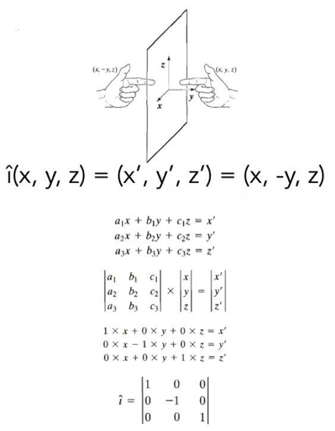

En el caso de las moléculas que tienen un centro quiral pueden poseer simetría, donde la moléculas o parte de la molécula es el motivo, lo cual es *pseudosimetría*.

### Simetría Radial

Este operador rota al motivo con respecto a un eje.

Se muestra un ejemplo para un motivo que rota al rededor del eje Z

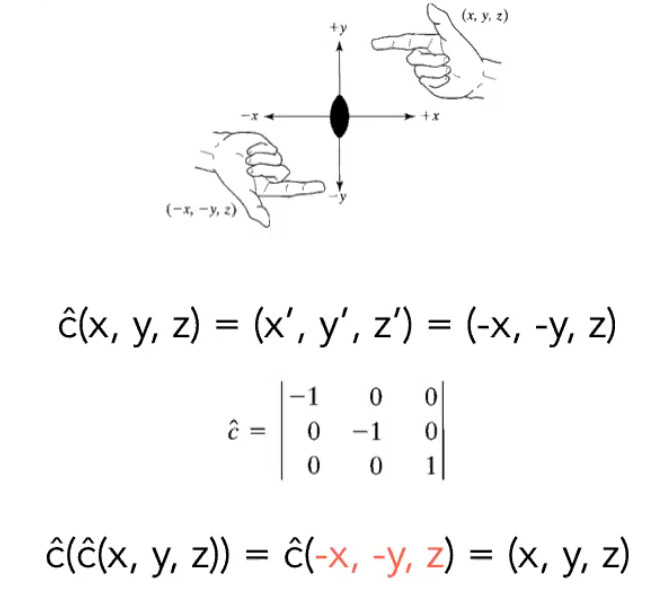

En este caso theta es el ángulo de rotación 

El número de veces que se usa el operador de simetría ayuda a describir mejor la simetría del motivo.

### Simetría helicoidal

Se define como la suma del operador rotacional y el operador traslacional

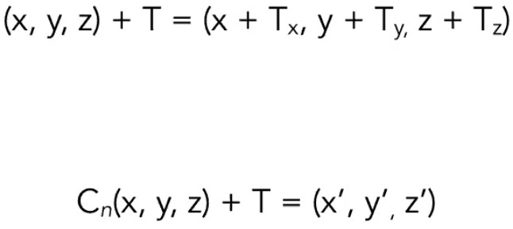 

### Estructura de las proteínas 

Tipos de proteínas 

- Proteínas globulares : Se conforman para formar estructuras esféricas, las cuales son solubles en medio acuoso, y poseen actividad enzimática.
- Proteínas fibrosas: Tienen conformación de fibras, son insolubles en agua, sin actividad catalítica, son usadas como proteínas estructurales.

### Aminoácidos 

Son las unidades básicas de los polipéptidos, estas están unidas mediante los carbonos alfa, tienen carbonos quirales, el 99% de las proteínas sin enantiómeros "L", con excepción de la glicina.

Existe una relación entre la actividad biológica y la simetría de las moléculas y su actividad.

## Clase #8 15/10/20

*Sin clase, paro de la facultad de químcia*

## Clase #9 20/10/20

*Sin clase, paro de la facultad de químcia*

## Clase #10 22/10/20

*Sin clase, paro de la facultad de químcia*

## Clase #11 27/10/20 

*Sin clase, el profe solicitó ver la última sección*

## Clase #12 29/10/20 

### Aminoácidos

Algunas características que destacan son:

- Son *quirales* en el carbono alfa en el cual las especies presentes en los aminoácidos es un ácido carboxílico, un amina, un hidrógeno y un grupo R.

- Los isómeros que conforman a las proteínas son aminoácidos de tipo L.

### Clasificación y características

Los 20 aminoácidos(AA) esénciales 

*Polares*

*Con cadena hidrofóbica en el grupo R*

Para poder medir las interacciones que existen entre los AA en medio acuoso se estableció una propiedad denominada *índice de hidropatía*, el valor de esta propiedad indica que una medida del carácter hidrofóbico(valores mayores a 0, sin interacciones con el agua) e hidrofílico(menores a cero, con interacciones favorables con el agua), entre mayor sea la magnitud del índice indicará que presenta un mayor carácter.

El índice de hidropatía es el menos logaritmo del cociente obtenido de dividir la fracción disuelta de un AA en una fase acuosa entre la fracción disuelta en una no acuosa.

*Comportamiento de los aminoácidos en una proteína*

Los cadenas hidrofóbicas de los residuos de AA encuentran dentro de la proteína evitando el contacto del agua.

*casos especiales*

Cuando estas cadenas presentan anillos aromáticas existen 3 posibles formas en las que es posible estar ordenados dos anillos:

- Paralelos: un anillo esta acomodado de forma paralela al otro anillo dentro de la molécula.

- Perpendiculares: Un anillo esta sobre un plano y e otro sobre otro perpendicular al otro (Este se encuentra mayoritariamente y se comprobó por medio de los rayos X).

- Paralelo desplazado: Es similar al paralelo pero esta desplazado uno de los anillos sobre el plano xy.

La explicación de por que se encuentra mayoritariamente es debido a que cuando esta en la orientación perpendicular tiene mayor de conformaciones lo cual en términos de la termodinámicamente es favorable por que aumenta la entropía al tener mayor número de arreglos.

*Con carga eléctrica*:  

Los residuos de AA que presentan carga mayoritariamente se encuentran en la superficie de la proteína ya que tienen interacciones favorables con las moléculas del agua.

Sin embargo puede ocurrir que residuos cargados de AA estén en el interior de la proteína, lo cual no es energéticamente favorable ya que tener una carga eléctrica en un medio no polar hace que la energía de AUTO ALGO sea muy elevada, lo cual se traduce a que es energéticamente desfavorable y por ello no pueden haber cargas libres, por lo cual si llegan a haber residuos cargados entro de la proteína estos están unido con otro residuo de carga opuesta para presentar carga neta cero, esta union forma un enlace denominado salino.

### Punto isoeléctrico de los AA y proteínas 

Este es el valor de pH en la cual un AA o una proteína presenta una carga neta igual a 0, lo cual se emplea en la identificación de proteínas y como método de separación de proteínas.

Además se pueden calcular la densidad electrónica por medio de la ecuación ro=(roI-pH)/PM

### Formación del enlace peptídico

La formación de un enlace peptídico(amida) entre dos aminoácidos une a los dos aminoácidos y la liberación de una molécula de agua.

Dicha polimerización sigue un sentido de polimerización la cual es a la derecha ya que del lado derecho se encuentra el grupo carboxilo.

Este enlace solo puede tener dos conformaciones(se unen por enlace sigma) cis o trans, se ha demostrado que el 99.9% de estos enlaces tienen conformación *trans*.

Lo anterior es debido a que debido a la formación de la amida hay fenómeno de resonancia y el enlace peptídico presenta un 40% de carácter pi(*por esto los 6 átomos adyacentes están en un plano*) y 60% sigma, por lo que no pude hacer rotación libre y la conformación es trans debido a que hay menor impedimento estérico lo cual lo hace mas favorable energéticamente.

Solo se observa la configuración cis, cuando el enlace peptídico tiene un residuo de prolina.

Existen 4 posibles rotaciones en el átomo alfa del enlace peptídico, de ellos son

- omega: es el que esta en el enlace peptídico el cual es trans pero puede girar con residuos de prolina.
- chi, fi y otra.

## Clase #13 03/11/20

### Número de polipeptidos que se pueden formar están restringidos

En este caso la composición esta restringida! es decir que hay un límite de residuos a usar y el tamaño esta restringido.

En este caso **W** es el número de posibles arreglos, donde **g** representa el número de espacios disponibles (tamaño del péptido) y **n** el número de partículas única que pueden ocupar ese espacio.

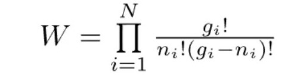

### La estructura primaria

La estructura primaria es la que determina la estructura terciaria.

Se ha observado que los polipéptidos que tiene secuencia parecida tengan una estructura terciaria parecida, pero no es de forma inversa ya que aunque tengan estructura terciaria no implica que tengan secuencia parecida.

Se ha estimado el grado de homología secuencial que se requiere para que tengan una estructura terciaria semejante que va del 25 al 30%

### Estructura secundaria 

Se puede definir en general como aquella estructura es regular(define que este arreglo presenta simetría) y es repetitiva

En el caso de que las moléculas biológicas que presentan quiralidad solo pueden formar hélices, las más comunes son 

-alfa helice: su estrcutura secundaria forma una hélice
-hoja beta: esta tiene pliegues pero es una helice

Son estructuras que se mantienen por medio de interacciones débiles que son principalmente por puentes de hidrógeno.

En el caso del alfa hélice los puentes que se forman son internos a la estructura del hélice, los vecinos(andamio de residuos) que participan son cotiguos de la estructura primaria que lo conforma.

En el caso de las hojas beta participan los átomos que conforman la cadena polipeptidica, es decir que no hay interacciones de los átomos de la cadena lateral, y estas interacciones se dan en vecinos no contiguos, Las hebras que participan en la formación de una hoja beta se conocen como hebras betas.

### Tipos de hélices 

-Alfa hélice 3-13: 3 número de residuos necesarios para formar un giro de 360 grados y 13 es el número de átomos que separan a un hidrógeno y un oxígeno que forman un puente de hidrógeno
-Hélice 3 10: hay 3 residuos para formar un giro y 10 átomos que separan a un H y un O para la formación del puente de hidrógeno.

Limitantes de la notación, esta no nos permite definir a la hoja beta que igual es una hélice, y no nos dice si tiene giro a la derecha o a la izquierda.

Las moléculas que participan tienen un centro quiral!

### Notación en función de la simetría helicoidal

Se puede usar la simetría helicoidal para describir y predecirla, con el operador helicoidal.

El operador helicoidal es la suma de dos operadores el rotacional y el operador de simetría translacional.

### Simetría helicoidal 

Partes de una hélice
Eje helicoidal o eje de hélice
h-incremento helicoidal(altura de cada uno de los residuos)
theta-ángulo helicoidal
P-paso de la hélice o paso de la cuerda 
c-repeticiones cuantas unidades necesito para dar un giro de 360 grados o 2Pi radianes

Se pueden construir los determinantes para poder construir el operador de simetría helicolidal.

Se muestra un caso específico tomando el eje Z

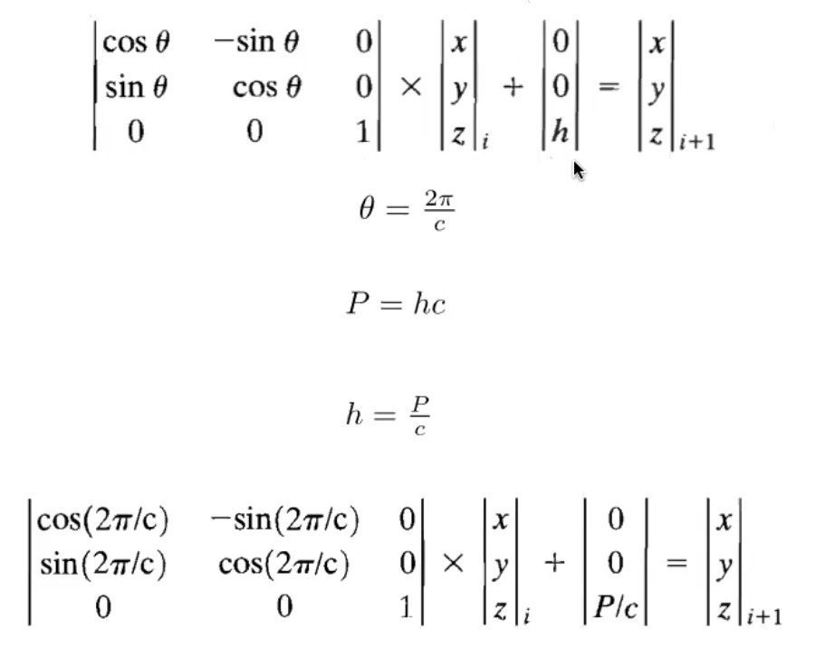

### Giros de las hélices

Si quiero tener giros hacia la derecha el valor del ángulo helicoidal debe ser mayor a cero y si son valores negativos serían giros hacia la izquierda 

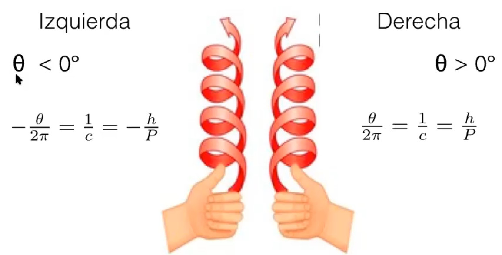

Por la convención que dimos no son permitidos los valores negativos, por lo que para tener valores negativos se solo se pueden hacer si se considera que el incremento o el número de repeticiones es negativo.

### particularidades de las hélices

Alfa hélice su giro es de 3.6 residuos de aminoácidos, por lo que sus giros son mas espaciados a comparación de la hélice 3 10, lo cual igual nos dice que su espacio interior es mayor.

La posición que ocupan las cadenas laterales será externa, estas estarán alineadas de formas distintas viéndolas desde una perspectiva superior(top) en el caso de las alfas las cadenas laterales están alternadas y en el caso de la 3 10 están casi empalmadas, esto nos indica que en la alfa habrá menos impedimento entre los grupos R y en el caso de la 3 10 habrá más esto igual explica que hay una mayor abundancia de las alfa hélices

### Notación NT

N:número de veces que aplica el operador rotacional para dar un giro.
T:traslación en fracción del motivo

esto es 3 10
N:3, T:1 3 sub 1

en la alfa es 3.6 10 

N:3.6 T:1 3.6 sub 1 para mostrar números enteros se obtiene la notación 18 sub 5

Cuando se busca un giro a la izquierda se aplica el que el sub índice es 2 y cuando es a la derecha es 1.

## Clase #14 05/11/20

### Notación helicoidal NT

En esta notación se indica con N el número de veces que se aplica el operador de simetría para obtener un giro completo y el subíndice T indica que la contribución de cada residuo en el giro por ejemplo la 3 10 que es 3 1 en la notación helicoidal nos dice que por cada tres residuos se da un giro de 360l como hay 1 nos dice que es hacia la derecha, pero además nos dice que la contribución de cada residuo es de 1/3, en el caso de que fuera 3 10 a la izquierda seria en notación helicoidal 3 2 que nos dice que igual con tres residuos se forma el giro pero este es hacia la izquierda que ahora va como 2/3.

Hay varias hélices y con la notación helicoidal vemos que hay :

- Helice trans es una confirguración que da una hebra beta recta.
- hoja beta: la hebra beta tiene dobleces 
-alfa helice
- 3 10
- ADN A, B, C y D

### Enlace peptídico

El enlace peptídico tiene carácter de doble enlace, por lo que no hay rotación libre, los giros permitidos están en los carbonos alfa que están en cada uno de los de los extremos del enlace.

Los ángulos diedros son 

Psi es el ángulo diedro formado entre carbono alfa y el carbono que tiene el oxígeno del carboxílico.

phi es en ángulo diedro formado entre el carbono alfa y el átomo de nitrógeno.

Los valores de psi y phi están restringidos por el impedimento estético de los grupos laterales.

### Gráficos de Ramachandran

En estos se pueden ver que los valores de phi y psi están cotejados por los grupos laterales R y en sus experimentos por medios de curvas de nivel curvas iso energéticas y es sus gráficos se ven los valores de menor energía es decir donde el sistema esta en equilibrio, por lo que estos no dicen que hay conformaciones más favorables que otras delimitadas por los ángulos phi y psi.

Con dichos valores de phi y psi permiten elucidar y predecir estructuras secundarias.

### Estructura de las proteínas globulares

- Proteínas in solubles (fibras)

    Insolubles en agua, cuya estructura terciaria se asemeja a fibras, son de super hélices (hélices formadas de hélices), su función de soporte o estructurales.

- Proteínas globulares 

    Son globulares son solubles en agua y tienen función catalítica, su estructura terciaria es de geometria esférica, tienen diversas formas.

El representar a las globulares con representación de listones, podemos observar que hay más formas de interpretar las estructuras además de su estructura terciaria y cuaternaria.

En varias proteínas con la estructura terciaría se obtiene la funcionalidad y en lagunas se requiere la cuaternaria para obtener su función biológica.

## Niveles de organización

Los cuatro convencionales son 

- Estructura primaria
- Estructura secundaria 
- Estructura terciaria 
- Estructura cuaternaria 

Se proponen además dos niveles de organización las estructura super secundaria y dominios

En la desnaturalización se observo que las proteínas tenían partes de estructuras persisten de que pese a la desnaturalización lo que da pie a pensar que estas estructuras son independientes, por que se dio la idea de estas estructuras podían ser clasificadas como dominio funcionales y estructurales.

### Estructura super secundaria 

Son estructuras que estar formadas por dos o más estructuras secundarias.

Las hojas betas son la unión de dos o más hebras betas, los grupos están alineados de forma perpendicular a la cadena y los puentes de hidrógeno que la unen son entre las cadenas de los residuos de la cadena polipeptídica.

## Clase #15 Estructura de las proteínas 10/11/20 

### Las estructuras super secundarias 

Son aquellas estructuras que son un conjunto de estructuras secundarias unidas por medio de iteraciones no covalentes como puentes de hidrógeno, por ejemplo las holas beta.

### Hojas beta 

Las hojas betas se forman de la unión de dos o mas estructuras secundarias conocidas como hebras beta, las cuales se unen de forma no contigua por medio de puentes de hidrógeno, en la cual no participan los grupos R en la estabilización de la hoja beta, en esta las cadenas laterales de las hebras que la conforman se encuentran en posición antiparalela con respecto al plano formado del enlace peptídico.

La cadenas pueden interaccionar entre si debido a que la cadena es girada en un ángulo de 180°, esto se denomina giro beta.

Debido a que estas se forman mediante puentes de hidrógeno esta solo puede se formada en ambientes hidrófobos, es decir que no se pueden formar en el exterior de las proteínas ya que estas los puentes de hidrógeno son mayoritarios con el disolvente, por lo que su formación es dentro de las proteínas.  

### Tipos de hojas beta

- paralela 
- antiparalela

### giros beta

Estos son consiste en un giro que cambia la dirección de las hebras beta, este giro es de 180° la cual esta dada por 4 residuos de aminoácidos, hay dos tipos los cuales se diferencian por la orientación que toma el tercer residuo, que hace el giro.

- tipo I el oxigeno del enlace peptídico esta en posición opuesta a donde se encuentra la cadena lateral 

- tipo 2 por las posiciones del grupo lateral podría haber impedimento estérico, pero se ha encontrados que los aminoácidos que los conforman son aminoácidos con cadenas lateras muy pequeñas, mayoritariamente son glicinas con un H como grupo R

- tipo 3 es una hélice 3 10 la cual se ha encontrado que se encuentran mayoritariamente en la superficie de las proteínas globulares 

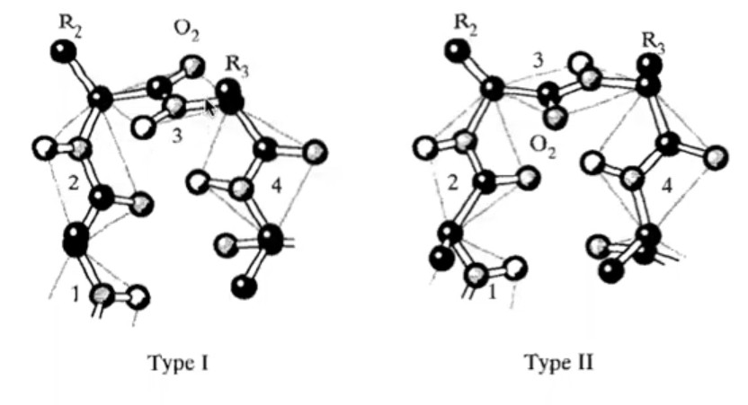

### clasificación por número de hebras 

- mendro beta cuando son más de 3 

- horquilla beta participan 2 o tres fragmentos de hebra beta 

- greca o llave griega tiene 4 fragmentos y tres son seguigos y la ultima está unido por un giro beta mas largo con el fragmento uno

- barril beta esta formada por hebras betas de forma antiparalela y forma un barril 

### beta x beta 
En donde beta se refiere a que hay una hebra beta, la x se refiere a que puede haber otro elemento de estructura secundaria que participa en la estructura super secudaria 

como por ejemplo beta alfa beta, esto es una hebra beta unida a una alfa helice y a otra hebra beta 

### hojas betas paralelas

Para tenerla se require de una cantidad más grande de residuos entre los elementos de hebra beta, esto que puedan acomodarse en el mismo sentido que la otra hebra beta y puedan tener las interacciones puentes de hidrógeno correspondiente.

### Otras tipos

**Estructura alfa alfa** participan dos alfa helices, pero pueden ser mas como alfa alfa alfa alfa, en donde estas están unidas por medio de un un fragmento de la cadena polipeptídica que no tiene estructura

### DOMINIOS

Elementos de la estructura terciaria que su estabilización es independiente de  otras regiones de la proteína, se supo al desnaturalizar y ver que estos dominios no perdían su estructura de forma.

### TIPOS

- Funcionales se refieren a que en esta región esta el sitio catalítico de la proteína, viendo que esta sección puede funcionar a pesar de que las demás partes de la proteína no tuvieran la estructura terciaria que se pensaba que era lo que le daba la funcionalidad 
- Estructurales regiones que poseen estructura 

Hay veces que se puede identificar el dominio funcional por la resencia de un grupo prostético (grupo no aminoácido que es parte de la estructura de hetero proteínas or de proteínas conjugadas)

### RMN

Lo que se obtiene son las posiciones de los átomos, con las posiciones y por medio del análisis con software de las posiciones se calculan los ángulos phi y psi para poder predecir las estructuras que puede tener.

En el caso de los gráficos de Ramachandran esta solo nos permite conocer información de la estructura secundaria, por lo que es una limitante, por lo se han desarrollado más métodos para poder tener más información de la estructura terciaria.

### gráficos de contacto o diagonal 

En este se busca conocer a los vecinos de un átomo en particular, se acostumbra tomar los carbonos alfa y se compara con otros 

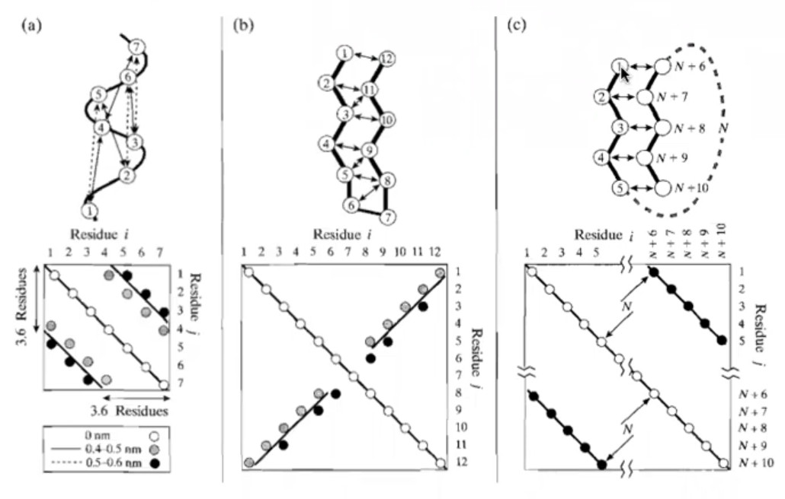
graficoDeContacto

En este se grafican como coordenadas a los átomos que estan a una x distancia entre si para poder ver si hay estructura supersecundaria, como hojas betas paralelas y antiparalelas, etc...

al graficarlo se observan padrones que nos indican que estructura poseen, para diferenciar una alfa helice de una hoja paralela se puede ver que hay una distancia de 3.6 residuos y en la hoja palaralela no, en el caso de una cruz nos muestra una hoja beta antiparalela.       

## Clase #16 gráficos de contacto, dudas y moléculas anfifílicas 12/11/20 

### gráficos de contacto 

Estos sirven para elucidar las estructuras super secundarias y un poco de las terciarias, ya que dependiendo de las distancias que se fijen es posible conocer parte de la estructura terciaria.

### Estructura cuaternaria  

Están conformados por subunidades que se proporciona su funcionalidad, pueden ser sub unidades iguales o distintas, por ejemplo si fueran dos subunidades serian homodímero y si fuerna 4 sería un homo tetrámero y si no serian hetero tetrámetro, las sub unidades están unidas por interacciones débiles.

ejemplo

*mioglobina* se encarga de almacenar oxigeno en los músculos.(es una proteína con estructura terciaria)

*hemoglonbina* se encarga de transporta el oxígeno por la sangre, esta constituida por 4 unidades de de mioglobina.

Se plantea que al formar dichos ensambres aumenta la entropía del sistema por que hay menos moléculas del agua en las proteinas ya que se reduce la superficie por lo que pueden haber mas clatlatos y hay mas interacciones puentes de hidrógeno.

Dichos ensambles no presentan necesariamente geometría pero al unirse ya presentan geometría, por lo que la simetría juega un papel importante.

### Moléculas anfifílicas 

### Proteínas 

Estas están construidas por aminoácidos pero presentan al estar expuestas en un disolvente (en el caso biológico es agua) estas presentarán los grupos hidrofílicos en la superficie de la proteína y los hidrofóbicos en el interior de la molécula, si fuera que la proteína estuviera en un disolvente polar esta tendría una organización inversa.

### Tenso activos o surfactantes

- aniónicos: cuentan con una cadena hidrofóbica y una cabeza con carga negativa, los más comunes son los sulfatos, sulfonatos y los carboxilatos.
- catiónica: es una cadena hidrofóbica con carga positiva, los más comunes son los, son difíciles de sintetizar y biodegradar y de alto costo.
-No iónicos: Son cadenas con su grupo hidrofóbico con un grupo polar como azucares y óxidos de polietileno.
-Anfóteris o zwitteriónico: Tienen una carga positiva o negativa en la cabeza y en la cadena hidrofóbica la carga contraria a la cabeza.

### Surfactantes convencionales

Estos están constituidos por una cabeza de carácter polar (hidrofílica) y una cadena de carácter no polar (hidrofóbica).

### Surfactantes sintéticos

- Gemini: Es la unión de dos moléculas anfifílicas convencionales por medio de un enlace en las cabezas polares o cerca de la cabeza hidrofílica, esto se conoce como espaciador (este debe ser rígido y pueden ser de carácter polar o apolar, o compuestos químicos lábiles).
- Bolaforme: Esa el análogo a los gemini pero están unidos en la cadena hidrofóbica en la zona media o final, 
-  Trímeros de surfactante: análogo a gemini, pero con tres moléculas anfifílicas.
- Polimérico: están conformadas por muchas moléculas anfifílicas de forma alternada unidas por las cabezas, formado una cadena de surfactantes.
- Diblock: polímero compuesto de dos unidades un monómero polar(P) repetido muchas veces y uno apolar(A) repetido muchas veces, PPPPPPAAAAA, de tal forma que se hace una cadena con carácter polar y apolar.

### Ventajas de los surfactantes sintetizados 

De forma general podemos decir que son más eficientes ya que se requieren una menor cantidad para cumplir las funciones que haría uno convencional, es decir que con son capaces de abatir la tensión superficial más fácil que una convencional, por lo que usas menor cantidad, pueden ser más resistentes(a su degradación) o estables.

*NOTA: **Cuando la cadena lateral crece la CMC disminuye** *

## Clase #17 Moléculas anfifíficas 17/11/20 

### ventajas geminis 

Por ejemplo se encuentra que la CMC de un gemini versus uno convencional puede ser hasta 2 ordenes de magnitud es decir que con 100 veces menos cantidad se requiere para realizar lo mismo que con e convencional, como disminuir la tensión superficial.

Los dibloques pueden ser hasta tribloque AAAAPPPPPPAAAAAA

### Moléculas anfifílicas en la naturaleza o biológicas

-Glicerofosfolípidos: se componen de un grupo glicero, dos cadenas alifáticas(resido de ácidos grasos)(hidrofóbica) y un grupo fosfato, en la cadena alifática puede tener inssaturaciones, se encuentran en la membrana celular.
-Esfingolípidos: resultados de la unión de la esfingocina con dos ácidos grados, se encuentran en las membranas celulares, en plantas, hongos y en el cerebro de los mamíferos.

### Membrana celular

No es de composición homogénea, es una región que tiene una gran cantidad de moléculas anfifílicas y es muy heterogénea, y no solo en los tipos de moléculas anfifílicas que hay, sino en 

### Otras moléculas anfifílicas

Las sales biliares son moléculas anfifílicas que no poseen las estructura convencional de una cadena hidrofóbica y una hidrofílica. ya que su sección hidrofóbica es un conjunto de anillos, y en sus superficie presentan grupos hidrofílicos, su estructura base (esqueleto) es el colesterol.

Estos se sintetizan en el hígado, y son secretados en el intestino delgado para solubilizar los lípidos ingeridos, y estos a su vez son procesados (fragmentados) por las lipasas.

### Sistemas moleculares organizados

Lás moléculas anfifílicas a ciertas concentraciones y a dadas ciertas temperaturas son capaces de formar agregados con geometrías particulares, las cuales están unidas mediante interacciones débiles, van der wals, dipolo-dipoo, dipolo-diploinducido, carga-carga,por lo anterior estos ensambles pueden ser desemsamblados y vueltos a ensamblar de la misma forma, esto es que la formación de estas es un **un proceso reversible** y su formación es **espontánea**.

### Efecto del disolvente y posibles arreglos

Se pueden formar los siguientes agregados en un solvente polar 

-micelas, micelas cilindricas y bicapas lipídicas

en donde la parte hidrofóbica siempre esta expuesta al disolvente y la cadena alifática esta en el interior de la estructura para no interactuar con el disolvente.

en no polares se pueden formar y su geometría es inversa que en un disolvente polar

-miscelas inversas y micelas cilindricas inversas

### Micelas

Estan son arreglos que tienen una forma esférica la cual tiene un diámetro de 3-6nm y están compuestos de 30 a 100 unidades monoméricas

En un sistema donde se agrega un anfifílo hay equilibrios dinámicos

Ya que en un vaso hay inicialmente la formación de una capa de monómeros en la interfase líquido vapor, lo cual abate la tensión superficial ya que cambia los puentes de hidrógeno que se habían formado en la superficie.

al aumentar la concentración las unidades monoméricas entran al bulto del disolvente y empiezan a formar estructuras, como las miscelas y estas mismas unidades están en constante movimiento en el arreglo, en el caso de que el recipiente presente un material polar o apolar habrán anfifílicos que estarán en dicha zona.

La duración de un afifílico en una de las estructuras formadas es muy corta es de 

### Efecto sobre la tensión superficial

Al aumentar la concentración del anfifilico se puede apreciar como decae la tensión superficial hasta un punto donde ya no decrese más, este disminución depende del tipo de anfifílico que se este usando, cuando ya no cambia se llega a la CMC que es la *concentración miscelar crítica*, esta disminución es de 10 a 20 veces más pequeñas que en el caso de normal que es sin la influencia de u tenso activo.

Además afecta a otras propiedades como:

- Presión osmótica
- turbidez
- solubilidad
- resonancia magnética
- tensión superficial 
- conductividad equivalente 
- auto difusión 

Dichos efectos se dan debido a las moléculas de anfifilo han formado de forma espontánea agregados supramoleculares, lo cual afecta las propiedades enlistadas.

### Proceso de formación de micelas

A bajas concentraciones del anfifilo se observa la absorción en la superficie pero su concentración no es muy elevada, pero es capaz de abatir la tensión superficial, conforma se va aumentando la concentración se observa que una pequeña cantidad empieza a formar agregados de entre 2 a 9 moléculas (esto se conoce como agregados premicelares), después de llegar a la concentración se llega a un punto donde no cambia el valor de la tensión superficial lo que nos dice que la superficie llego al límite de moléculas que puede tener en la superficie (CMC) y después de dicha concentración su valor es prácticamente constante, en esta concentración se forman los agregados de tipo miscelar.

La formación de dichos agregados hace que el sistema este favorecido (esto lo sabemos debido que fue un proceso espontáneo así que la energía será menor, es decir más favorecido energéticamente)

# gráfico de formación de miscelas de moléculas anfifílicas.

Se pueden construir gráficas de un tenso activo de forma particular en donde se grafica en el eje y la concentración de agregado (concentración del anfifilo) y en el eje x el número de agregación (es el número de moléculas que  participan en un agregado miscelar), en estos gráficos se pueden apreciar como varia el número de moléculas que necesitan cuando en función de la concentración del anfifílo, donde se aprecia que con un numero reducido de 0 a 9 se van formando las agregados premiscelares.

# Dinámica de las moléculas de anfifilo

El sistema no es estático por lo que se ve que estas pueden estar en constante "movimiento", ya que cada molécula, participa en los diversos equilibrios.

los tiempos que participan una molécula varía de las dependiendo de la cadena alifatica

- Decilsulfato 0.5 microsegundos
- Dodecilsulfato 6 microsegundos
- tetradecilsulfato 83 microsegundos

Por lo anterior podemos ver que mientras más larga sea la cadena mayor será el tiempo de residencia del anfifilo en el agregado miscelar.

## Clase #18 Termodinámica de los agregados miceslares 19/11/20

### Termodinámica de los agregados micelares

Se forman los agregados para evitar las interacciones poco favorables con el disolvente, ya que al formar los agregados se tienen mayores interacciones favorables con el disolvente.

El caso de los anfifilos en agua se evitan las interacciones poco favorables de las cadenas alifáticas con las moléculas de agua.

### Micela

Su formación es espontánea, y en su caso es un proceso de tipo reversible, es decir que es capaz de autoensamblarse y desemsamblarse.

De forma general se forman agregados de entre 30 a 100 moléculas de anfifilo y su diametro va de 3-6nm estas pueden variar dependiendo de la molécula.

Para la obtención de la CMC es necesario el seguir una propiedad que varíe cuando se llega a la CMC la cual se identificará ya que al llegar a una concentración **X** que será la CMC se apreciará un cambio marcado en la propiedad analizada, este cambio se da por la formación de los agregados micelares.

### Agragados micelares proceso

-Antes de la CMC

Se da la formación de dos grupos de agregados, unos pequeños que van de 2 a 10 **(en el caso particular del SDS)** y de 30-60 los cuales son denominados agregados premicelares.

-Al llegar a la CMC

Crece la concentración de agregados pequeños y se da un crecimiento significativo en los de mayor tamaño(agregados micelares) en la cual se desplaza el máximo y aumenta e rango de moléculas que lo conforman 30-70 (es decir aumenta a dispersión).

-Después de la CMC

La concentración de agregados pequeños es cte, y aumenta la concentración de agregados micelares y e número de moléculas aumenta pero poco de 30-75.

### adsorción en la superficie

Las moléculas tendrán un equilibrio dinámico entre ellas para la formación de los agregados, en uno de ellos participaran en la adsorción en la superficie, o formación de micelas, en la cual estarán un tiempo participando este tiempo se denomina tiempo de residencia.

Dicho tiempo varia conforme al tamaño de la cadena alquílica, mientras más grande sea la cadena más tiempo será mayor su tiempo de residencia esto se debe a que aumenta el número de interacciones favorables de tipo van der wals entre las cadenas alquílicas.

### Efecto de la temperatura 

La CMC varia de forma poco significativa con la temperatura, es prácticamente cte.

-Anfifilios iónicos
Observando un diagrama de fases se puede observar que las moléculas de anfifilo pueden formar cristales a dicha temperatura en la cual los cristales se solubilizan es conocida como temperatura de Kraff, en el caso de que se empiecen a formar cristales y la solución pase de ser un sistema homegéneo se conoce como punto Cloud donde se da la formación de cristales de anfifilo, la curva que separa ambas fases en el diagrafa de fases se denomina curva de coexistencia.

-Anfifilios no iónicos

Si se aumenta la temperatura en el caso de las moléculas no ionicas se causa la insolubilidad del anfifilo, y se da una separación de fases, la cual se separa por la curva de coexistencia.

-Anfifilos Zwitterionicos

A bajas temperaturas son insolubles y a altas concentraciones del anfifilo son solubles.

### Factores antagonicos para la formación de micelas.

La formación de micelas genera un ΔS<0 esto nos dice que disminuye la entropía del sistema y esto es por que las moléculas de anfifilo al agruparse limitan el número de posibles conformaciones por lo que disminuye a entropía.

En el caso contraría cuando el agua forma estructuras tipo clatrato para poder envolver a una molécula de anfifilo esta restringida, pero cuando se forman los agregados micelares estas se liberan y esto aumenta la entropía del sistema, por lo que la ΔS>0 ya que pueden tener mas posibles arreglos.

De lo anterior hay que recalcar que

        |ΔSmicelización| << |ΔSmedio(aguasliberadas)|

**Por lo anterior se denota que la contribución entrópica esta dominada por el medio y no por la formación del agregado micelar y esto es lo que promueve la formación de micelas.**

### Impedimento estérico

Dentro de las micelas no es posible formar agregados perfectamente cerrados, esto es por que habrá impedimento estérico, por lo que habrán interacciones con el disolvente, las cuales no serán favorables ya que podrán estar en contacto con las cadenas alifáticas debido a que no es posible un empaquetamiento eficiente.

### Fuerza iónica

La CMC disminuye conforme aumenta la cadena alifática.

Y al ingresar una sal como NaCl se aprecia el efecto de la fuerza iónica, ya que en caso de los surfactantes iónicos habrán interacciones de repulsión entre la cabezas cargadas, y al agregar un ión este es capaz de apantallar el efecto de las repulsiones electrostáticas repulsivas entre las cabezas, por lo que se puede dar con mayor facilidad la formación de los agregados micelares.

## Clase #19 Tipos de agregados miceslares 24/11/20

Los agregados supramoleculares no están perfectamente compactados debido a que existen interacciones de repulsivas de corto alcance entre las cabezas hidrofílicas, por lo que siempre existirán interacciones de las cadenas alifáticas con el agua.

### Tipos de agregados supramoleculares no micelares

Los tipos de agregados que se pueden forman dependen de varios parámetros, en especial cada una de las posibles geometrías que pueden ser formadas dependen de las geometrías de la molécula de los anfifílos, para poder conocerla se puede conocer por medio de un parámetro que se conoce como *parámetro de surfactante o razón de empaquetamiento*.

### Parámetro de surfactante

Esta se obtiene mediante una fórmula empírica que usa los siguientes parámetros.

- V volumen de la región alifática del anfifílo.
- lc Longitud de la cadena alifática del anfifílo.
- alfa zero Área efectiva de la zona hidrofílica.

Esta fórmula empírica esta pensada para moléculas de anfifílo convencionales que son una cabeza hidrofílica y una cadena alifática.

Ns=v/alfaZero*lc

v ≈ (0.026nc+0.059) nm^3 
lc ≈ (0.127+0.15) nm^3 
0.127 distancia de enlace, 0.15radio de la esfera
nc=número de carbonos de la cadena alifática 
alfa se puede aproximar a la proyección de una figura geométrica.

Los valores de Ns para las diversas figuras geométricas son 

Ns=0.33 cilindro
Ns=0.5 triángulo ancho
Ns=1 cilindro 

    Una vez conocida la geometría del anfifílo es posible predecir las posibles geometrías que poseerá el agregado supramolecular.

### limitantes

El radio de la región alifática puede ser igual o menor al valor real, ya que esta pueden tener dobleces de tipo zigzag.

Además el área efectiva de la región hidrofílica es mucho mayor a la proyección que se estima.

Por lo que si bien es una buena aproximación, no es totalmente exacta.

### Tipos de agregados en función de la geometría 

En la sig imagen se muestran las posibles geometrías que pueden adoptar los agregados supramoleculares en función del valor de Ns 

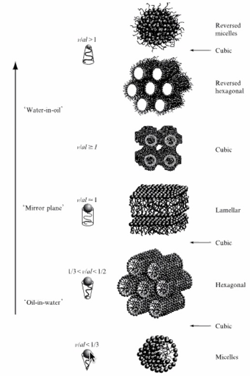

Los anfifílos con geometría cilindrica solo pueden hacer agregados de tipo lamellar (capas) y no pueden formar micelas debido a que tendrían demasiado espacio en las micelas y su empaquetamiento no sería óptimo.

Los anfifílos con valores de Ns menores a uno son capaces de formar más estructuras.

Las que tienen valor de Ns=0.333 son capaces de formar micelas, cilindros y cilindros hexagonales, dichas preferencia en las geometrías dependen de otros factores.

### Tipos de uniones 

Hay dos tipos de uniones las tipo A y tipo B las cuales son uniones entre las estructuras supramoleculares, las cuales están bien definidas.

estás se dan por la unión de bloques (otras unidades supramoleculares)

Son denominadas fases bicontínuas ya que se dan entre dos fases que no son homogéneas entre si.

Notas las lamelas son las estructuras que conforman a las membranas celulares.

### Propiedades que afectan la geometría de los agregados.

- Temperatura, esta pueden promover ciertas geometrías, pero a altas temperaturas se encarga de desensamblar los agregados.
- Mezcla de anfifílos, al agregar otras moléculas de anfifílo es posible el arlterar la geometría del agregado supramolecular.
- Adición de electrolitos, debido a que los electrolitos son capaces de apantallar las interacciones repulsivas entre las cabezas hidrofílicas estas pueden promover que existan otras geometrías.

### Técnicas de detección de micelas

Solo se verán las relacionadas con la tensión superficial, pero al seguir más propiedades es posible conocer la CMC.

Es importante recalcar que formalmente la CMC pese a ser reportada tiene un grado de sensibilidad, ya que esta es realmente un rango de concenrtación donde se aprecia el cambio abrupto en las propiedades que se siguen en función de la concentración para poder determinar la CMC.

### Tensión superficial 

Existen dos tipos de tensión superficial

- Estático o en equilibrio: Es la que se pueden medir cuando el sistema esta en equilibrio termodinámico y su valor es independiente del tiempo.
- Dinámico: Es la que se mide en un sistema con una evolución en el tiempo, es un proceso cinético, con el cual se pueden observar el envejecimiento del sistema.

La formación de la monocapa de moléculas de anfifílo requiere de un tiempo t para poderse formar.

### Velocidad de difusión y adsorción en la superficie.

La formación de la monocapa de una moléculas de anfifílo puede verse como es que a traves del tiempo.

Cuando se perturba un sistema y se obteniendo la tensión superficial de una solución con moléculas de anfifílo es posible el ver por medio del valor de la tensión superficial el como esta es abatida conforme se da la formación de la capa de moléculas de anfifílo cuando se adsorben en la interfase líquido-vapor.

Las interfaces se forman rápidamente en varios procesos como la espumación, atomización, impresión, emulsificación y recubrimiento.

En el caso de las moléculas de anfifílo tendrán un coeficiente de difusión mayor a uno de mayor tamaño.

El conocer el como se difunden para su adsorben las moléculas de un afifílo en la interfaz líquido vapor para su uso en distintas aplicaciones.

### Métodos de obtención de la tensión superficial 

- Dinámicos
    - Presión máxima de burbuja
    - Presión de la gota
    - Gota pendiente

- Estáticos
    - Anillo
    - Placa de Willheim

## Clase #20 Métodos de la tensión superficial 26/11/20

Recordar que la CMC es un intervalo de concentración.

Esta es capaz de proporcionarnos más información además de la formación de agregados supramoleculares.

Esta nos proporciona información del área de la molécula del anfifílo, y la concentración superficial de exceso en la interfaz líquido-vapor.

Existen diversos métodos para la determinación de la CMC a través de la tensión superficial, pero muchas de estas metodologías lo obtienen de forma incorrecta.

Como el el caso del seguimiento de la tensión superficial en función de la concentración, en la cual se emplean dos rectas para poder aproximar el valor de la CMC, esta tienen como inconvenientes que la aproximación dependen del criterio de la persona al decidir donde colocar las rectas(ya que los intervalos que se fijan son arbitriarios) y su intersección será el valor de la CMC, por lo que dicho valor se hace subjetivo.

En dicha determinación se usa la siguiente expresión, donde gamma mayúscula es la concentración superficial de exceso.

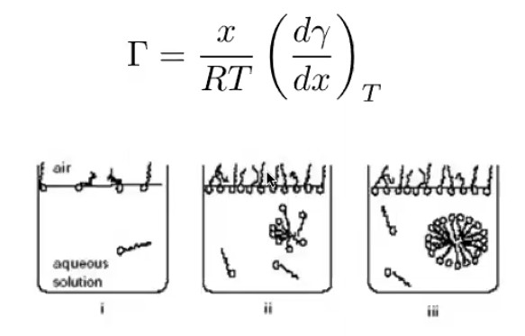

Por lo que podemos ver que conforme aumenta la concentración de anfifílo [x] disminuye la tensión superficial, hasta el valor de CMC ya que después de eso se mantiene constante el valor de la tensión superficial.

### Isoterma de Gibbs

Por medio de la ecuación de la isoterma de Gibbs se puede realizar el calculo de la CMC empleando los valores experimentales de una mejor forma.

Dicha expresión es la misma mostrada anterior mente con la diferencia de que la pendiente es dpi/dx

En donde x es la fracción molar, dπ es el diferencial de la presión superficial donde esta se define como 

    π = γ_liq - γ_mezcla

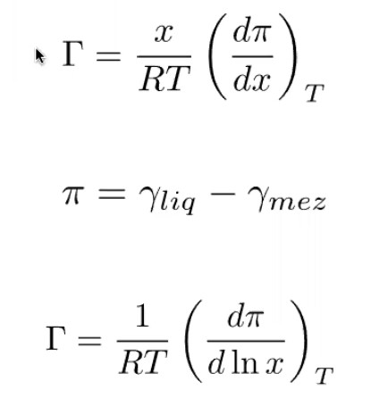

    
γ_liq es la tensión superficial del líquido y γ_mezcla es la tensión superficial de un líquido con una cantidad conocida de anfifilo.

El valor de π será positivo ya que la tensión superficial de la mezcla será siempre menor a la del líquido.

Al graficar la concentración del anfifílo contra la presión superficial se pueden observar tres estadios 

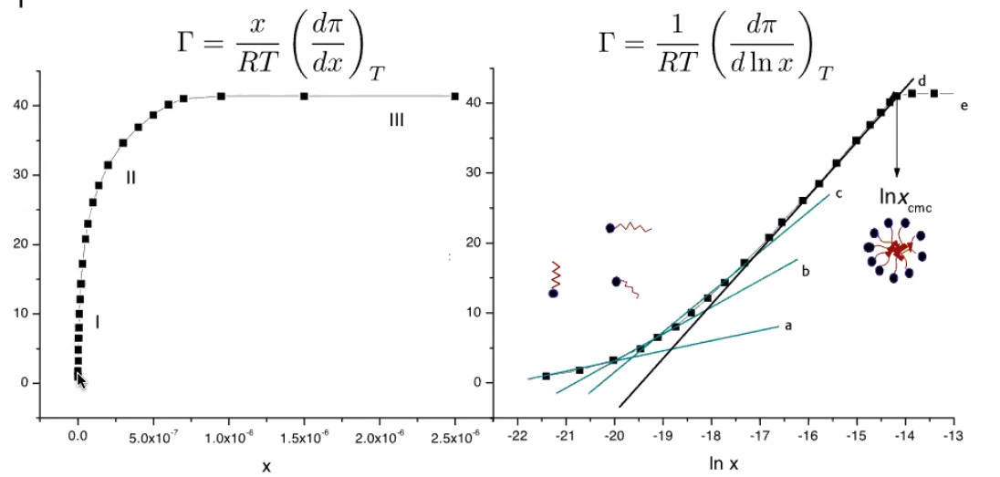

#### Gráfica 1

En la región I hay una pequeña concentración del anfifilo, y se da un cambio grande(drástico)en la presión superficial π.

En la región II se aprecia un aumento significativo pero con una curva más suave de la presión superficial.

En la región III se puede apreciar que el cambio de la presión es nulo, con respecto a la concentración.

Empleando las propiedades de los logaritmos es posible expresar la isoterma en términos de logaritmos.

#### Gráfica 2

Al graficar con los mismos datos en su forma logarítmica la fracción molar se pueden apreciar con mayor precisión en valores de logaritimo de la concentración, por lo que es mejor usar esta forma gráfica para determinar la CMC.

En un caso todavía más ilustrativo y como mejor aproximación, es cuando se grafica el (dπ/dx) vs el ln(x)

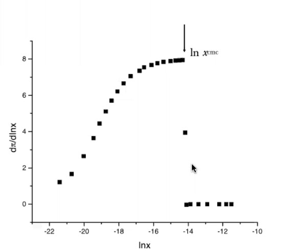

en la cual se pueden aprecia más notoria el cambio de un estado a otro en la cual es más fácil ver que la CMC es un intervalo en el cual se da la formación de los agregados micelares.

Mientras mayor sea el número de datos en la región en donde esta el intervalo de la CMC e intervalo será menor y su valor central será el más confiable.

### Termodinámica del proceso de micelización 

Recordando que la entropía del sistema varía a dos hechos que son la formación de los agregados micelares y la liberación de agua al formarse los agregados.

En la cual se concluye que la variación de entropía que influye principalmente en la formación de los agregados es el aumento de la entropía al liberarse las moléculas de agua de las estructuras tipo clatrato para poder formar puentes de hidrógeno con más moléculas de agua.

Esto nos dice que la formación de micelas se da por el cambio de entropía en el sistema.

Además hay interacciones favorables y no favorables en la formación de estos agregados, en la región hidrofílica hay interacciones repulsivas entre la región polar, y repulsivas entre las moléculas de agua que entran en contacto con las regiones hidrofóbicas, en el caso de las favorecidas son las interacciones de las regiones polares con el agua, así como las interacciones de van der wals entre las cadenas alifáticas, que pese a tener interacciones no favorables, son mayores las favorables, además de que en cadenas de mayor longitud estas aumentan.

### Modelos para el proceso de formación de micelas

Existen dos modelos para el planteamiento de la formación de agregados supramoleculares 

- Modelo de separación de fases
- Modelo de acción de masas o equilibrio múltiple.

### Modelo de separación de fases 

Este es propuesto por hartley, esta misma propone que los agregados micelares forman una fase.

Propone definir el potencial químico de un anfifílo como si estuvieran en forma monomérica en el disolvente, por lo que se emplea la ecuación del potencial químico.

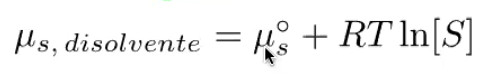

En donde conforme se aumenta la concentración de anfifílo aumenta el potencial.

Pero el propone que en los agregados micelares el valor del potencial será constante en las moléculas de anfifílo, por lo que es independiente de su concentración y del tamaño del agregado micelar, se podría considerar como una propiedad intrinsico.

Cuando la concentración del anfifílo aumenta se formarán los agregados micelares, por lo que llegaremos a la igualdad de que el potencial químico de la molécula de anfifílo sea la misma que el del agregado micelar y se puede hacer la siguiente igualdad.

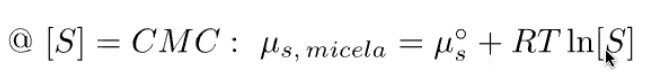

En donde [S] es la CMC del anfifílo.

Por medio del potencial químico podemos obtener el cambio en la energía libre de Gibbs para el proceso de micelización. 

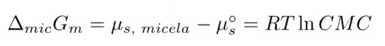

Miu cero es el potencial estándar la molécula del anfifílo.

Las limitantes del modelo, es que no nos da información del tamaño de agregado micelar y el número de moléculas de anfifílo que las conforman, no nos da información de la polidispercidad.

### Modelo de acción de masas o equilibrio múltiple

Este modelo es propuesto por bor, en el cual se plantean múltiples equilibrios entre las distintos tipos de agregados.

Por medio de los equilibrios planteados, se proponen el cálculo de las constantes de equilibrio en función de las actividades, en la supocición de que la solución sea diluida podemos considerar que la actividad es uno, por que se pueden definir la constante de equilibrio en función de las concentraciones de las especias que participan en el equilibrio, en este caso los tipos de agregados formados **n** moléculas de anfifílo.

Por medio de la constante de equilibrio podemos relacionarla con la definición del potencial químico, en el equilibrio el potencial químico es constante por lo que podemos igualar el potencial de las especies.

El potencial del lado izquierdo pertenece a la moléculas del anfifilo en agua y del lado derecho estará el potencial de los agregados formados por n moléculas de anfifílo.

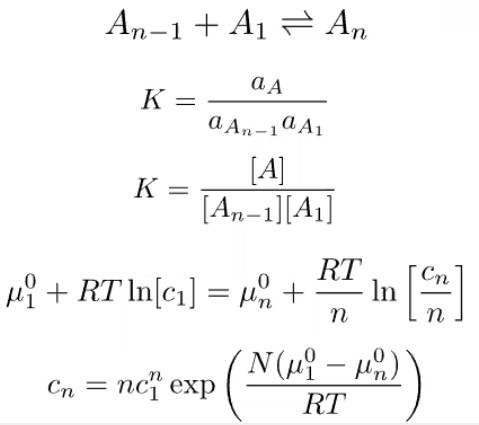

Por medio del dicho tratamiento es posible conocer información del tamaño de los agregados micelares que se forman así como el número de moléculas que conforman a los agregados micelares.

Además de eso es posible calcular las propiedades termodinámicas como en el caso del modelo de separación de pases por medio del delta G de separación de fases, pero este es más poderoso ya que nos da información de los agregados que se forman.

Para obtener la delta G de micelización necesitamos usar la entalpía y entropía de micelización.

Por lo que es complicado este método es por el cálculo de la entropía del proceso de micelización, ya que no hay métodos experimentales para calcularla, por lo que se debe usar la energía de Helmontz para calcular la entropía .

### Métodos de obtención de la entalpía de micelización

- Calorimetría 
- Análisis de van't Hoff

### Calorimetría

La calorimetría tiene el problema de ser complicado de calcular debido a que cada anfifílo tiene valores distintos de CMC, por lo que se llego al acuerdo de calcularla a una concentración fija de concentración de anfifilo(ya que la entalpía depende de la concentración), ya que los valores variaban en la literatura.

### Análisis de van't hoff

Este consiste en obtener varias constantes de equilibrio a distintas temperaturas.

Por medio de la ecuación observamos que si graficamos el logaritmo de la constante de equilibrio contra la temperatura obtendremos la entalpía de micelización entre RT.

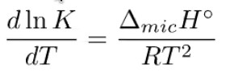

También se encontraron discrepancias de entre los valores de entalpías debido a que el número de moléculas de anfifílos varía con respecto a la temperatura, es decir que se altera la polidispersidad de los agregados micelares, esto afectal al valor calculado en la entalpía.

Por lo que este método funciona mejor para sistemas donde se ve afectado poco la polidispercidad con la temperatura.

### Calculo de la entropía 

Por lo que la entropía de por lo tanto se calcula por medio de la ecuación de Gibbs-Heltmozs.

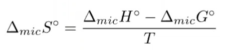

Por lo que se tiene que obtener experimentalmente la entalpía y la energía libre.

## Clase #21 Métodos de la tensión superficial 01/11/20

